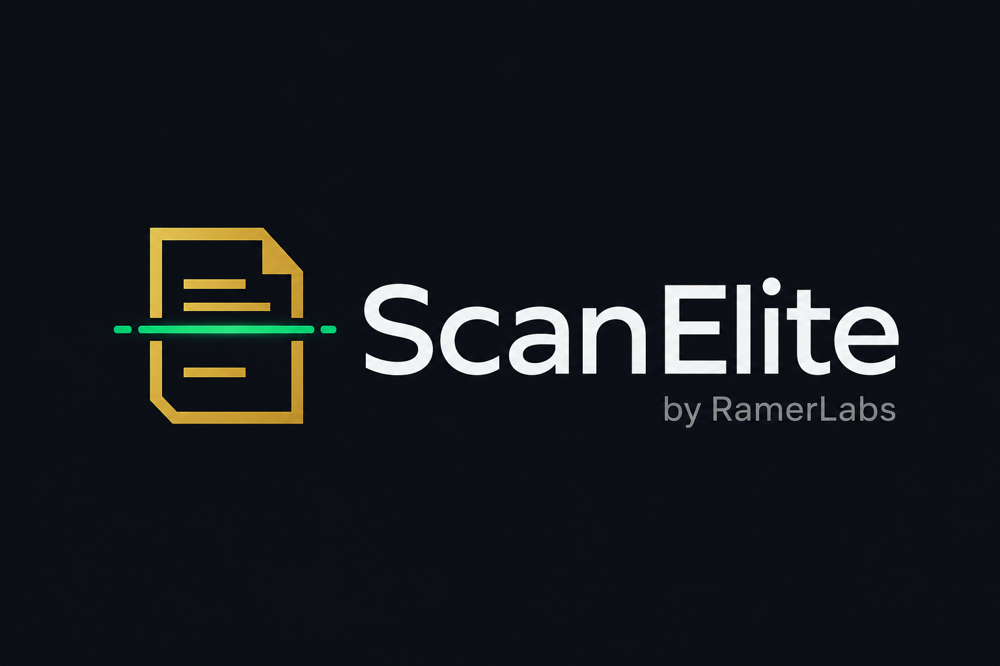

# ScanElite



Premium Android document scanner — capture, auto-align, enhance, and share.

**Licensed product by [RamerLabs](https://ramerlabs.com)** · [ramerlabs.com](https://ramerlabs.com)

Buy / activate: **[ScanElite on ramerlabs.com](https://ramerlabs.com/product/scanelite/)**

---

## License

ScanElite requires a valid **license key** from the RamerLabs store.

1. Purchase at [https://ramerlabs.com/product/scanelite/](https://ramerlabs.com/product/scanelite/)
2. Open the app → enter your key → **Activate**
3. Use Settings → **Replace license** to switch keys

Category: **Mobile App** · Lifetime license · 1 device activation

---

## App (Android)

Kotlin · Jetpack Compose · CameraX · Room · Hilt · RamerLabs License Manager client

### Run
1. Open this folder in Android Studio  
2. Gradle sync  
3. Run `app` on emulator/device (grant camera + internet)

```bash
./gradlew :app:assembleDebug
```

### Flows
- License gate → Splash → Home → Camera (Single / Batch) → Enhance → Review → Share Hub

---

## Spec

- [`docs/SCANELITE_UI_UX_SPEC.md`](docs/SCANELITE_UI_UX_SPEC.md)
- [`config/scanelite.config.json`](config/scanelite.config.json)

---

## Credits

© RamerLabs · [https://ramerlabs.com](https://ramerlabs.com)
